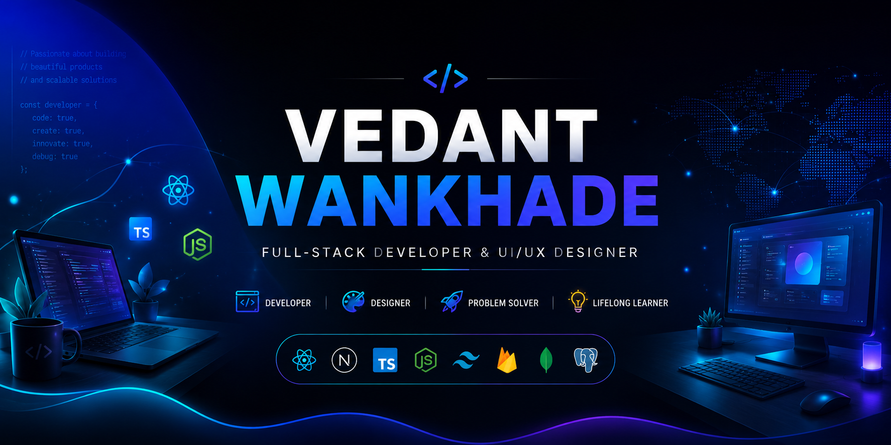

  

   
   

  

  

    <strong>Enthusiastic Coder | Full-Stack Developer | UI/UX Designer</strong>
  

  
  

    I am a passionate software engineer from India, focusing on building premium, interactive web applications with an emphasis on seamless UI/UX design. I enjoy creating sophisticated architectures utilizing the MERN stack and keeping up with the modern programming era.
  

  
  

## 🚀 Tech Stack

  
  <h3>🌐 Frontend</h3>
  

    
    
    
    
    
    
    
    
  

  
   
   
  
  <h3>⚙️ Backend</h3>
  

    
    
    
  

  
   
   

  <h3>🗄️ Database</h3>
  

    
    
    
    
  

   
   

  <h3>🧠 AI & ML</h3>
  

    
    
    
    
  

   
   

  <h3>🛠️ Tools</h3>
  

    
    
    
    
    
  

  

## 💻 Featured Projects

  <table>
    <tr>
      <td width="50%" valign="top">
        <h3 align="center">🔍 AI Leak & Anomaly Detection</h3>
        
An intelligent system designed to detect leaks and anomalies efficiently using modern artificial intelligence techniques.

        
<strong>Tech Stack:</strong> Python, AI/ML Libraries

        

      </td>
      <td width="50%" valign="top">
        <h3 align="center">🏥 Healbook</h3>
        
A comprehensive application focused on healthcare and medical tracking, built with strong TypeScript foundations.

        
<strong>Tech Stack:</strong> TypeScript, Node.js

        

      </td>
    </tr>
    <tr>
      <td width="50%" valign="top">
        <h3 align="center">🌐 Eph-Hub</h3>
        
A robust hub platform for centralized communications and seamless user management.

        
<strong>Tech Stack:</strong> React, Node.js, Express

        

      </td>
      <td width="50%" valign="top">
        <h3 align="center">✨ Portfolio Website</h3>
        
Premium, interactive portfolio of Vedant Wankhade built with React, Vite, GSAP, and Tailwind CSS. Includes a synchronized live voice tour.

        
<strong>Tech Stack:</strong> TypeScript, React, Vite, GSAP, Tailwind CSS

        

      </td>
    </tr>
    <tr>
      <td width="50%" valign="top">
        <h3 align="center">🛒 Ekdanta E-Commerce</h3>
        
A stylish and responsive e-commerce solution providing a seamless shopping experience for users.

        
<strong>Tech Stack:</strong> MERN Stack

        

      </td>
      <td width="50%" valign="top">
        <h3 align="center">🎨 Drawgit</h3>
        
An innovative digital drawing and version control integration tool for developers and designers.

        
<strong>Tech Stack:</strong> HTML, CSS, JavaScript

        

      </td>
    </tr>
  </table>

  

## 📊 GitHub Analytics

  <picture>
    <source media="(prefers-color-scheme: dark)" srcset="https://github-readme-stats.vercel.app/api?username=vedantwankhade123&show_icons=true&theme=tokyonight&hide_border=true&bg_color=00000000">
    <source media="(prefers-color-scheme: light)" srcset="https://github-readme-stats.vercel.app/api?username=vedantwankhade123&show_icons=true&theme=default&hide_border=true&bg_color=00000000">
    
  </picture>
  <picture>
    <source media="(prefers-color-scheme: dark)" srcset="https://github-readme-stats.vercel.app/api/top-langs/?username=vedantwankhade123&layout=compact&theme=tokyonight&hide_border=true&hide=html,css&custom_title=Most%20Used%20Languages&bg_color=00000000">
    <source media="(prefers-color-scheme: light)" srcset="https://github-readme-stats.vercel.app/api/top-langs/?username=vedantwankhade123&layout=compact&theme=default&hide_border=true&hide=html,css&custom_title=Most%20Used%20Languages&bg_color=00000000">
    
  </picture>

 

  <picture>
    <source media="(prefers-color-scheme: dark)" srcset="https://github-readme-streak-stats.herokuapp.com/?user=vedantwankhade123&theme=tokyonight&hide_border=true&background=00000000">
    <source media="(prefers-color-scheme: light)" srcset="https://github-readme-streak-stats.herokuapp.com/?user=vedantwankhade123&theme=default&hide_border=true&background=00000000">
    
  </picture>

 

  <picture>
    <source media="(prefers-color-scheme: dark)" srcset="https://github-readme-activity-graph.vercel.app/graph?username=vedantwankhade123&theme=tokyonight&hide_border=true&bg_color=00000000">
    <source media="(prefers-color-scheme: light)" srcset="https://github-readme-activity-graph.vercel.app/graph?username=vedantwankhade123&theme=default&hide_border=true&bg_color=00000000">
    
  </picture>

  

## 🐍 Contribution Graph

  <picture>
    <source media="(prefers-color-scheme: dark)" srcset="https://raw.githubusercontent.com/vedantwankhade123/VedantWankhade/output/dist/github-contribution-grid-snake-dark.svg">
    <source media="(prefers-color-scheme: light)" srcset="https://raw.githubusercontent.com/vedantwankhade123/VedantWankhade/output/dist/github-contribution-grid-snake.svg">
    
  </picture>

  

## 🎯 Current Focus

  <table>
    <tr>
      <td>🌱 <strong>Currently Learning:</strong> Advanced MERN Stack Architectures & UI/UX Principles</td>
      <td>🛠️ <strong>Working On:</strong> Full-Stack Applications with intuitive User Interfaces</td>
    </tr>
    <tr>
      <td>🤝 <strong>Looking to Collaborate on:</strong> Open Source React, Node.js, & Design Projects</td>
      <td>💬 <strong>Ask Me About:</strong> Frontend Development, UI/UX, React, & Backend APIs</td>
    </tr>
  </table>

  

## ⚡ Fun Facts

- 🎨 **Design meets Code:** I love bridging the gap between aesthetic design and functional logic.
- 🚀 **Performance First:** My applications are designed to be fast, responsive, and beautifully structured.
- 🕵️ **Problem Solver:** Crafting seamless user experiences and robust architectures keeps my brain sharp.

  

## 📫 Let's Connect

  
  
  
  

 

  

 

  

